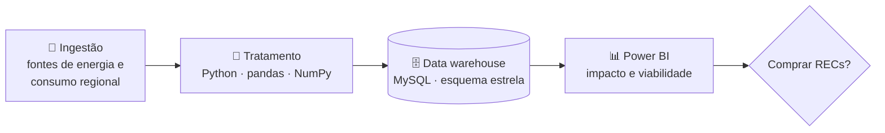

<a href="https://gotardon1.github.io/GotardoN1/#projeto/recs">
  <picture>
    <source media="(prefers-color-scheme: dark)" srcset="https://raw.githubusercontent.com/GotardoN1/GotardoN1/main/assets/projetos/recs-dark.svg">
    
  </picture>
</a>

**[Ver no portfólio interativo](https://gotardon1.github.io/GotardoN1/#projeto/recs)** · **[Perfil](https://github.com/GotardoN1)**

## Sobre

Análise do consumo de energia e da adoção de **Certificados de Energia Renovável (RECs)** por empresas. O projeto usa engenharia de dados e business intelligence para apoiar decisões sustentáveis.

O pano de fundo é a transição energética: trocar combustíveis fósseis por fontes alternativas. Com dados regionais, com foco em **Salvador**, e modelagem dimensional, o projeto aponta oportunidades de compra de RECs. Isso ajuda as empresas a cumprir metas de emissão de **gases de efeito estufa (GEE)**.

## Arquitetura da solução

| Etapa | O que acontece |
|---|---|
| **1. Ingestão** | Coleta de dados sobre fontes de energia e consumo regional |
| **2. Tratamento** | Limpeza e filtragem com Python (pandas e NumPy) |
| **3. Armazenamento** | Data warehouse em MySQL para consultas analíticas |
| **4. Visualização** | Painel no Power BI com indicadores de impacto e viabilidade |

**Conceitos aplicados:** ETL, modelagem dimensional (esquema estrela) e sustentabilidade corporativa.

## Neste repositório

| Arquivo | Conteúdo |
|---|---|
| [`Apresentacao2.pptx`](Apresentacao2.pptx) | Apresentação do projeto, com a arquitetura e os resultados |

## Autores

| | |
|---|---|
| **Fabrício Corrêa de Souza** | **Matheus Gonçalves Gotardo** |
| **Nicole Guerreiro Diniz** | **Willian de Andrade Baggio** |

---

Mais projetos: <a href="https://github.com/GotardoN1/bi-eficiencia-energetica">BI e eficiência energética</a> · <a href="https://github.com/GotardoN1/grafo-social">Grafo Social</a> · <a href="https://gotardon1.github.io/GotardoN1/#projetos">todos no portfólio</a>

